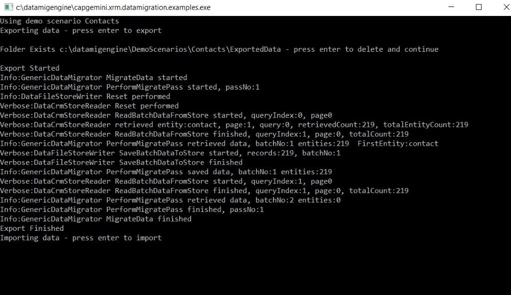
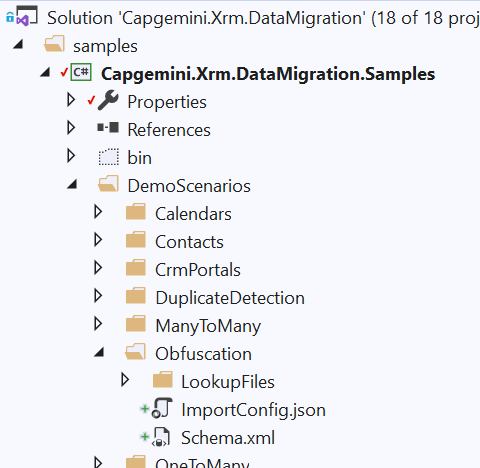

# Capgemini CRM Data Migration

Build Status [](https://capgeminiuk.visualstudio.com/Capgemini%20Reusable%20IP/_build/latest?definitionId=42)

## Description

This Data Migration project provides a flexible powerful engine based on the XRM SDK which allows CRM Dynamics Configuration, Reference and Seed data to be extracted, stored in version control and loaded to target instances. The engine supports two file formats JSON and CSV and supports the migration of simple reference data entities (e.g. Titles, Countries) to more complex scenarios around Security Roles and Teams. This allows data to be managed in the same way as code and a release can be created that can load the required data to support the released functionality.

## Table Of Contents

1. [Installation](#Installation)
1. [Usage](#Usage)
   1. [Obfuscation](#Obfuscation)
1. [Contributing](#Contributing)
1. [Credits](#Credits)
1. [License](#License)

## Installation

### Visual Studio Instructions

Clone the [Git Repository](https://github.com/Capgemini/xrm-datamigration)

Open example project (Capgemini.Xrm.Datamigration.Examples) and edit configuration file (App.config):

```xml
  <applicationSettings>
    <Capgemini.Xrm.Datamigration.Examples.Properties.Settings>
      <setting name="DemoScenarioName" serializeAs="String">
        <value>Contacts</value>
      </setting>
      <setting name="CrmExportConnectionString" serializeAs="String">
        <value>AuthType=OAuth; Username=jsmith@contoso.onmicrosoft.com; Password=passcode; Url=https://contosotest.crm.dynamics.com; AppId=51f81489-12ee-4a9e-aaae-a2591f45987d; RedirectUri=app://58145B91-0C36-4500-8554-080854F2AC97; LoginPrompt=Auto; RequireNewInstance=True;</value>
      </setting>
      <setting name="CrmImportConnectionString" serializeAs="String">
        <value>AuthType=OAuth; Username=jsmith@contoso.onmicrosoft.com; Password=passcode; Url=https://contosotest.crm.dynamics.com; AppId=51f81489-12ee-4a9e-aaae-a2591f45987d; RedirectUri=app://58145B91-0C36-4500-8554-080854F2AC97; LoginPrompt=Auto; RequireNewInstance=True;</value>
      </setting>
      <setting name="UseCsvImport" serializeAs="String">
        <value>False</value>
      </setting>
    </Capgemini.Xrm.Datamigration.Examples.Properties.Settings>
  </applicationSettings>
```

- **DemoScenarioName** - Scenario name from the scenarios in DemoScenarios Folder :
- **CrmExportConnectionString** - Connection string for the source Dynamics 365 instance - used by export
- **CrmImportConnectionString** - Connection String for the target Dynamics 365 instance - used by import
- **UseCsvImport** - True - **Csv** format used, False - **Json** files used

The example project will extract data from one CRM instance (Export Instance) to a folder and then will subsequently load the data into a second CRM istance (Import Instance).

Initially set up some data in the Export CRM Instance

Run the console application and follow messages

In the bin folder there will be output folder and files with exported data created, eg. running **Contacts** scenario


In the Import CRM instance you can check if all the data is created as expected.

### Command Line Instructions

Download the [Latest Release](https://github.com/Capgemini/xrm-datamigration/releases) of Capgemini.Xrm.DataMigration.Engine.zip


Unblock the zip and extract the contents


As part of the package there are a number of examples in the Demo Scenarios folder. Please visit the [Examples](https://github.com/Capgemini/xrm-datamigration/wiki/Examples) wiki page for more details on the examples


To execute a scenario navigate to the Capgemini.Xrm.Datamigration.Examples.exe.config file and edit the file. You can create your own scenarions by adding aditional DemoScenarios folders and creating your own configuration files.


Edit configuration file:

```xml
  <applicationSettings>
    <Capgemini.Xrm.Datamigration.Examples.Properties.Settings>
      <setting name="DemoScenarioName" serializeAs="String">
        <value>Contacts</value>
      </setting>
      <setting name="CrmExportConnectionString" serializeAs="String">
        <value>AuthType=OAuth; Username=jsmith@contoso.onmicrosoft.com; Password=passcode; Url=https://contosotest.crm.dynamics.com; AppId=51f81489-12ee-4a9e-aaae-a2591f45987d; RedirectUri=app://58145B91-0C36-4500-8554-080854F2AC97; LoginPrompt=Auto; RequireNewInstance=True;</value>
      </setting>
      <setting name="CrmImportConnectionString" serializeAs="String">
        <value>AuthType=OAuth; Username=jsmith@contoso.onmicrosoft.com; Password=passcode; Url=https://contosotest.crm.dynamics.com; AppId=51f81489-12ee-4a9e-aaae-a2591f45987d; RedirectUri=app://58145B91-0C36-4500-8554-080854F2AC97; LoginPrompt=Auto; RequireNewInstance=True;</value>
      </setting>
      <setting name="UseCsvImport" serializeAs="String">
        <value>False</value>
      </setting>
    </Capgemini.Xrm.Datamigration.Examples.Properties.Settings>
  </applicationSettings>
```

- **DemoScenarioName** - Scenario name from the scenarios in DemoScenarios Folder
- **CrmExportConnectionString** - Connection string for the source Dynamics 365 instance - used by export
- **CrmImportConnectionString** - Connection String for the target Dynamics 365 instance - used by import
- **UseCsvImport** - True - **Csv** format used, False - **Json** files used

Initially set up some data in the Export CRM Instance

To execute run Capgemini.Xrm.Datamigration.Examples.exe

When prompted confirm the scenario being executed


Prior to Export you will be prompted about the Export folder the data will be exported to


Once the data export part of the process completes you will be asked to confirm if you wish to continue and import the data to the Import CRM instance. At this point it is possible to verify the data exported in the ExportData folder which is created in the specific Demo folder you are executing. For example C:\........\DemoScenarios\Contacts\ExportedData



Following import you will receive confirmation and you can verify the data in the target CRM Instance


## Usage

Create a new console app and add [Capgemini.Xrm.DataMigration](https://www.nuget.org/packages/Capgemini.Xrm.DataMigration.Engine) Nuget


Xrm DataMigration Engine classes are available to be used in any custom scenario eg.

_Export Example_

```c#
        static void ExportData(string connectionString, string schemaPath, string exportFolderPath)
        {
            if (!Directory.Exists(exportFolderPath))
                Directory.CreateDirectory(exportFolderPath);

            var tokenSource = new CancellationTokenSource();
            var serviceClient = new CrmServiceClient(connectionString);
            var entityRepo = new EntityRepository(serviceClient, new ServiceRetryExecutor());
            var logger = new ConsoleLogger();
            var exportConfig = new CrmExporterConfig()
            {
                BatchSize = 1000,
                PageSize = 500,
                FilePrefix = "EX0.1",
                JsonFolderPath = exportFolderPath,
                OneEntityPerBatch = true,
                SeperateFilesPerEntity = true,
                TopCount = 10000,
                CrmMigrationToolSchemaPaths = new List<string>() {schemaPath}
            };

            // Json Export
            var fileExporterJson = new CrmFileDataExporter(logger, entityRepo, exportConfig, tokenSource.Token);
            fileExporterJson.MigrateData();

            // Csv Export
            var schema = CrmSchemaConfiguration.ReadFromFile(schemaPath);
            var fileExporterCsv = new CrmFileDataExporterCsv(logger, entityRepo, exportConfig, tokenSource.Token, schema);
            fileExporterCsv.MigrateData();
        }
```

_Import Example_

```c#
        public static void ImportData(string connectionString, string schemaPath, string exportFolderPath)
        {
            var tokenSource = new CancellationTokenSource();
            var serviceClient = new CrmServiceClient(connectionString);
            var entityRepo = new EntityRepository(serviceClient, new ServiceRetryExecutor());
            var logger = new ConsoleLogger();

            var importConfig = new CrmImportConfig()
            {
                FilePrefix = "EX0.1",
                JsonFolderPath = exportFolderPath,
                SaveBatchSize = 20
            };

            // Json Import
            var fileImporterJson = new CrmFileDataImporter(logger, entityRepo, importConfig, tokenSource.Token);
            fileImporterJson.MigrateData();

            //Csv Import
            var schema = CrmSchemaConfiguration.ReadFromFile(schemaPath);
            var fileImporterCsv = new CrmFileDataImporterCsv(logger, entityRepo, importConfig, schema, tokenSource.Token);
            fileImporterCsv.MigrateData();
        }
```

The engine has been used for a number of scenarios on a number of projects. See wiki for a list of [examples](https://github.com/Capgemini/xrm-datamigration/wiki/Examples).

Features of the engine include the support for many-to-many relationships, application of filters, building relations via composite keys and GUID mappings.

The engine is controlled by three configuration files, a fuller explanation of the values can be found in the wiki.
**DataSchema.xml** - Defines details of the entities and attributes that are to be extracted.

**DataExport.json** – Holds details of the schema to use, filters to be applied and other run controls.

**DataImport.json** - Holds details of the location and prefix of the Exported files that are to be loaded.

## Obfuscation

### What is data obfuscation?

Data Obfuscation, also referred to as data masking or scrambling, is the process of manipulating data so that it bears no resemblance to the original value, whilst still
following any patterns that are required for a systems testing and validation processes to function. For example, if postcode validation is a feature of the system then
when obfuscating a postcode, it must be substituted with a real postcode as a replacement.

Obfuscation is a highly important process when moving sensitive data such as Personally Identifiable Information or sensitive data related to a person or commercial entity
between Dynamics Organisations. Failing to obfuscate sensitive data during a data migration could expose the information to unauthorised personnel which would potentially be a
breach of the General Data Protection Regulation (GDPR).

### Usage

The sample project in the repository contains a DemoScenario called Obfuscation that applies obfuscation to some of the fields in a contact record. **This demo scenario does
not cover all fields in the entity and should not be used in production.**



When running the sample console application with Obfuscation set as the DemoScenarioName's value as below, an ExportConfig.json will be generated by the application
at runtime. The file is located in the bin folder bin\Debug\DemoScenarios\Obfuscation.

```
<setting name="DemoScenarioName" serializeAs="String">
    <value>Obfuscation</value>
</setting>
```

#### Configuration

There are two methods of obfuscating data that can be applied. The default method takes the original value and replaces it using a scrambling algorithm suitable
for the data type of the attribute. The other option is applying a format in the same way you would use String.Format in C#. Each of the format items are replaced by a format argument with types of RandomString, RandomNumber and Lookup that can be applied.

Below is the schema of an obfuscation item.

```
{
  "FieldsToObfuscate": [
    {
      "EntityName": "Required",
      "FieldsToBeObfuscated": [
        {
          "FieldName": "Required",
          "ObfuscationFormat": "Optional",
          "ObfuscationFormatArgs": [
            {
              "FormatType": "Optional",
              "Arguments": {Optional}
            }
          ]
        }
      ]
    }
  ]
}
```

**For more information about the obfuscation feature please take a look at the [Wiki](https://github.com/Capgemini/xrm-datamigration/wiki/Obfuscation) page.**

## Contributing

To contribute to this project, report any bugs, submit new feature requests, submit changes via pull requests or even join in the overall design of the tool.

## Credits

Special thanks to the entire Capgemini community for their support in developing this tool.

## License

The Xrm Data Migration is released under the [MIT](LICENSE) license.
