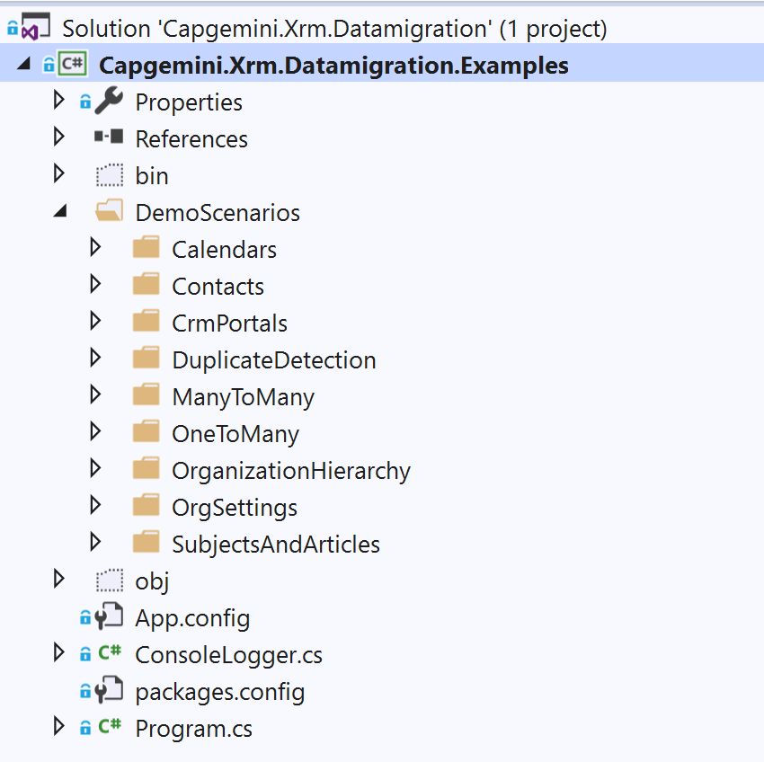
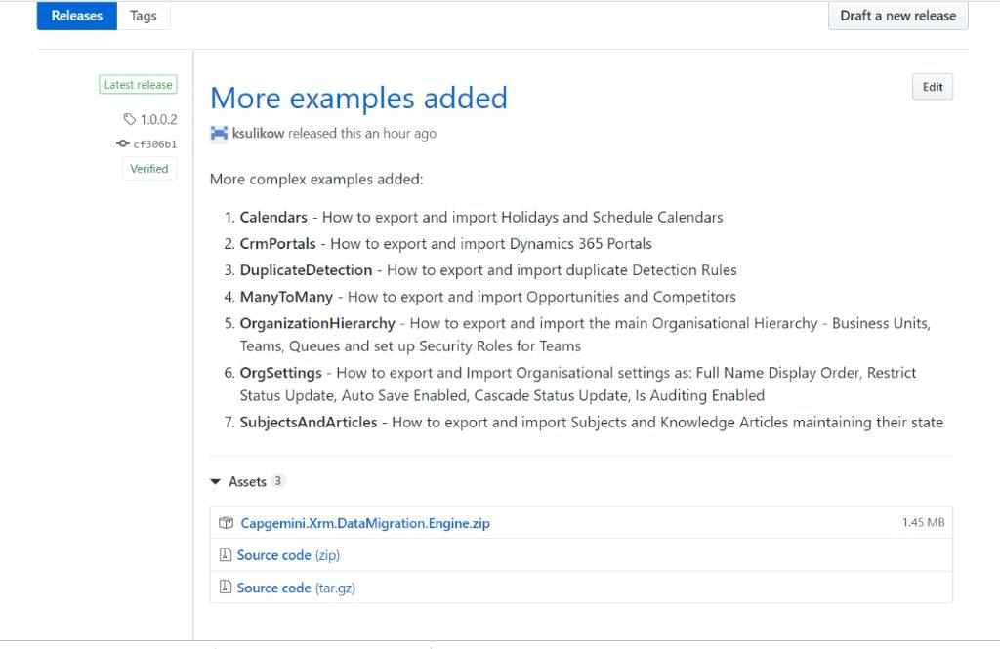
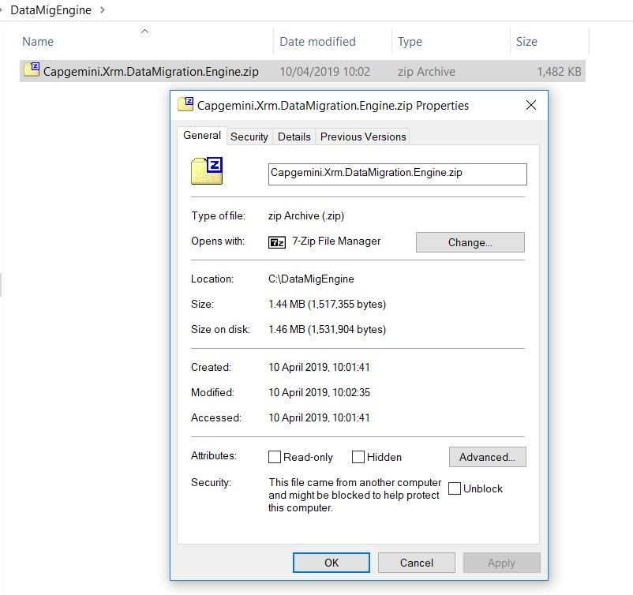
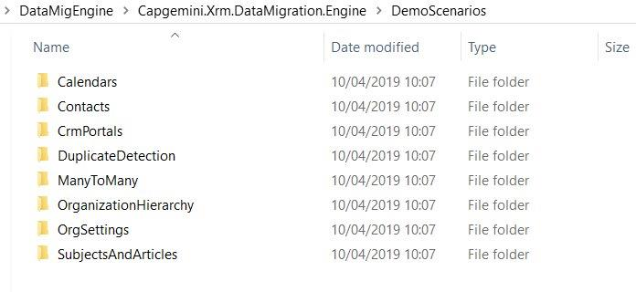
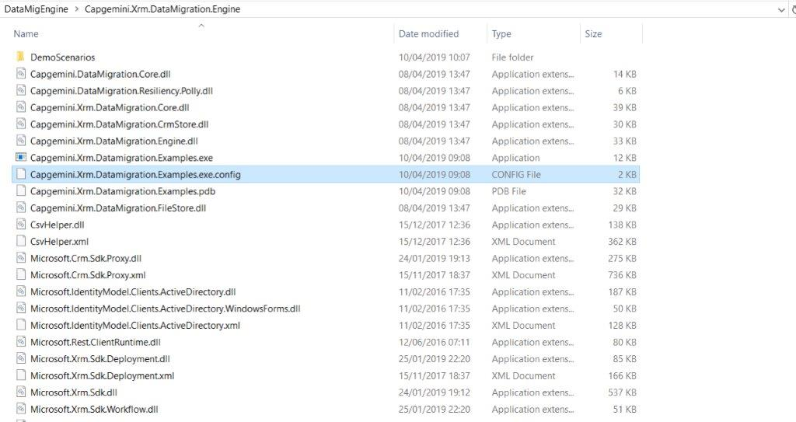
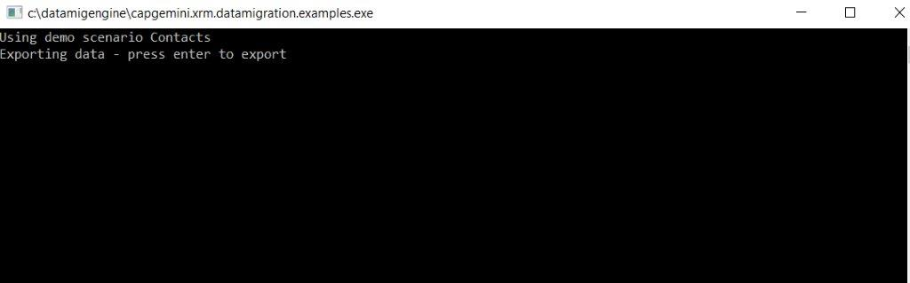
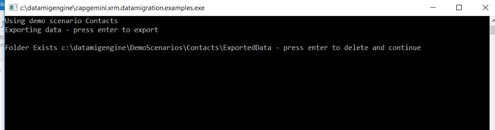
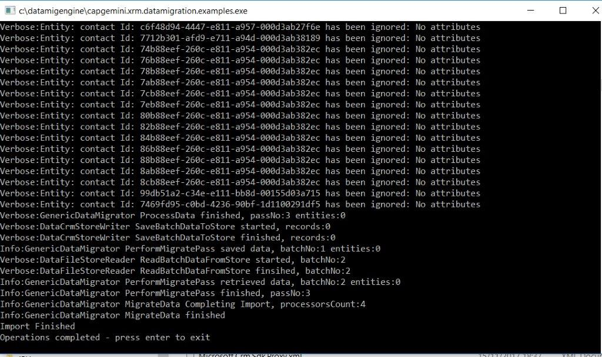

# Capgemini CRM Data Migration

Build Status [](https://capgeminiuk.visualstudio.com/Capgemini%20Reusable%20IP/_build/latest?definitionId=42)

## Description

This Data Migration project provides a flexible powerful engine based on the XRM SDK which allows CRM Dynamics Configuration, Reference and Seed data to be extracted, stored in version control and loaded to target instances.  This allows data to be managed in the same way as code and a release can be created that can load the required data to support the released functionality.

## Table Of Contents
1. [Description](#Description)  
1. [Installation](#Installation)
1. [Usage](#Usage)
1. [Contributing](#Contributing)
1. [Credits](#Credits)
1. [License](#License)

## Installation

### Visual Studio Instructions

Clone the [Git Repository](https://github.com/Capgemini/xrm-datamigration)

Open example project (Capgemini.Xrm.Datamigration.Examples) and edit configuration file (App.config):

```xml
  <applicationSettings>
    <Capgemini.Xrm.Datamigration.Examples.Properties.Settings>
      <setting name="DemoScenarioName" serializeAs="String">
        <value>Contacts</value>
      </setting>
      <setting name="CrmExportConnectionString" serializeAs="String">
        <value>Url = CRMUrl; Username=user; Password=password; AuthType=Office365; RequireNewInstance=True;</value>
      </setting>
      <setting name="CrmImportConnectionString" serializeAs="String">
        <value>Url = CRMUrl; Username=user; Password=password; AuthType=Office365; RequireNewInstance=True;</value>
      </setting>
      <setting name="UseCsvImport" serializeAs="String">
        <value>False</value>
      </setting>
    </Capgemini.Xrm.Datamigration.Examples.Properties.Settings>
  </applicationSettings>
```

- **DemoScenarioName** - Scenario name from the scenarios in DemoScenarios Folder :
- **CrmExportConnectionString** - Connection string for the source Dynamics 365 instance - used by export
- **CrmImportConnectionString** - Connection String for the target Dynamics 365 instance - used by import
- **UseCsvImport** - True - **Csv** format used, False - **Json** files used

Set up some data example in the source CRM Instance 

Run the console application and follow messages

In the bin folder there will be output folder and files with exported data created, eg. running **Contacts** scenario


In the target CRM instance you can check if all data is created as expected.


### Command Line Instructions

Download the [Latest Release](https://github.com/Capgemini/xrm-datamigration/releases)



Unblock the zip and extract the contents



As part of the package there are a number of examples in the Demo Scenarios folder



To execute a scenario navigate to the Capgemini.Xrm.Datamigration.Examples.exe.config file and edit the file



Edit configuration file:

```xml
  <applicationSettings>
    <Capgemini.Xrm.Datamigration.Examples.Properties.Settings>
      <setting name="DemoScenarioName" serializeAs="String">
        <value>Contacts</value>
      </setting>
      <setting name="CrmExportConnectionString" serializeAs="String">
        <value>Url = CRMUrl; Username=user; Password=password; AuthType=Office365; RequireNewInstance=True;</value>
      </setting>
      <setting name="CrmImportConnectionString" serializeAs="String">
        <value>Url = CRMUrl; Username=user; Password=password; AuthType=Office365; RequireNewInstance=True;</value>
      </setting>
      <setting name="UseCsvImport" serializeAs="String">
        <value>False</value>
      </setting>
    </Capgemini.Xrm.Datamigration.Examples.Properties.Settings>
  </applicationSettings>
```

- **DemoScenarioName** - Scenario name from the scenarios in DemoScenarios Folder
- **CrmExportConnectionString** - Connection string for the source Dynamics 365 instance - used by export
- **CrmImportConnectionString** - Connection String for the target Dynamics 365 instance - used by import
- **UseCsvImport** - True - **Csv** format used, False - **Json** files used

Set up some data example in the source CRM Instance 

To execute run Capgemini.Xrm.Datamigration.Examples.exe

When prompted confirm the scenario being executed



Prior to Export you will be prompted about the Export folder the data will be exported to



Once Export complete you will be asked to confirm if you wish to continue with the Import.  At this point it is possible to verify the data exported in the ExportData folder which is created in the specific Demo folder you are executing.  For example   C:\DataMigEngine\DemoScenarios\Contacts\ExportedData


Following import you will receive confirmation and you can verify the data in the target CRM Instance




## Usage

Create a new console app and add [Capgemini.Xrm.DataMigration](https://www.nuget.org/packages/Capgemini.Xrm.DataMigration.Engine) Nuget


Xrm DataMigration Engine classes are available to be used in any custom scenario eg.

*Export Example*
```c#
        static void ExportData(string connectionString, string schemaPath, string exportFolderPath)
        {
            if (!Directory.Exists(exportFolderPath))
                Directory.CreateDirectory(exportFolderPath);
           
            var tokenSource = new CancellationTokenSource();
            var serviceClient = new CrmServiceClient(connectionString);
            var entityRepo = new EntityRepository(serviceClient, new ServiceRetryExecutor());
            var logger = new ConsoleLogger();
            var exportConfig = new CrmExporterConfig()
            {
                BatchSize = 1000,
                PageSize = 500,
                FilePrefix = "EX0.1",
                JsonFolderPath = exportFolderPath,
                OneEntityPerBatch = true,
                SeperateFilesPerEntity = true,
                TopCount = 10000,
                CrmMigrationToolSchemaPaths = new List<string>() {schemaPath}
            };

            // Json Export
            var fileExporterJson = new CrmFileDataExporter(logger, entityRepo, exportConfig, tokenSource.Token);
            fileExporterJson.MigrateData();

            // Csv Export
            var schema = CrmSchemaConfiguration.ReadFromFile(schemaPath);
            var fileExporterCsv = new CrmFileDataExporterCsv(logger, entityRepo, exportConfig, tokenSource.Token, schema);
            fileExporterCsv.MigrateData();
        }
```

*Import Example*
```c#
        public static void ImportData(string connectionString, string schemaPath, string exportFolderPath)
        {
            var tokenSource = new CancellationTokenSource();
            var serviceClient = new CrmServiceClient(connectionString);
            var entityRepo = new EntityRepository(serviceClient, new ServiceRetryExecutor());
            var logger = new ConsoleLogger();

            var importConfig = new CrmImportConfig()
            {
                FilePrefix = "EX0.1",
                JsonFolderPath = exportFolderPath,
                SaveBatchSize = 20
            };

            // Json Import
            var fileImporterJson = new CrmFileDataImporter(logger, entityRepo, importConfig, tokenSource.Token);
            fileImporterJson.MigrateData();

            //Csv Import
            var schema = CrmSchemaConfiguration.ReadFromFile(schemaPath);
            var fileImporterCsv = new CrmFileDataImporterCsv(logger, entityRepo, importConfig, schema, tokenSource.Token);
            fileImporterCsv.MigrateData();
        }
```


The engine supports two file formats JSON and CSV and has been used for a number of scenarios on a number of projects.  It is extremely flexible and supports the migration of simple reference data entities (e.g. Titles, Countries) to more complex scenarios around Security Roles and Teams.  See wiki for a fuller list of examples (link).

Other features of the engine are the support for many-to-many relationships, application of filters, building relations via composite keys and GUID mappings. 

The engine is controlled by three configuration files, a fuller explanation of the values can be found in the wiki.
**DataSchema.xml** - Defines details of the entities and attributes that are to be extracted.

**DataExport.json** – Holds details of the schema to use, filters to be applied and other run controls.  See wiki for a more details explanation.

**DataImport.json** - Holds details of the location and prefix of the Exported files that are to be loaded.

## Contributing

To contribute to this project, report any bugs, submit new feature requests, submit changes via pull requests or even join in the overall design of the tool.

## Credits

Special thanks to the entire Capgemini community for their support in developing this tool.

## License

The Xrm Solution Audit is released under the [MIT](LICENSE) license.
